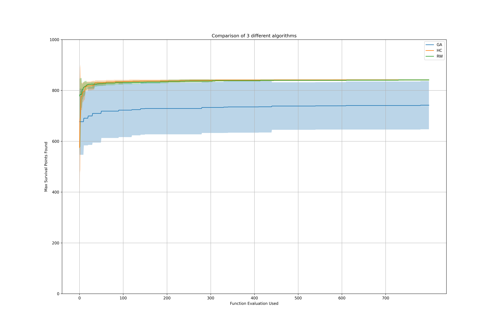
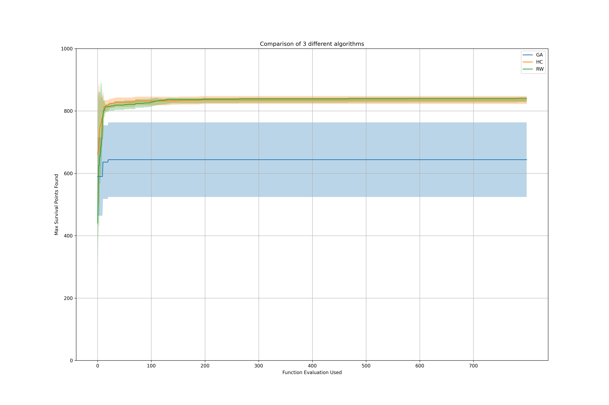

This problem can not be solved by traditional Linear or Nonlinear programming method.

So we use the Heuristic Algorithms and the reply of each sub-problem are listed below.

__(a)__
- Statement : Pick items from the list and every item should only be picked once.
- Goal : Find a combination of items that can maximize the total survival points.
- Constraints
	- Carry at most 529 weight units 
	- Must carry at least one knife, one pistol and one equipment
- Objective Function :
	- The survival points of all carrying items + bonus points  

Given a solution X, I use function in `Problem2_util.py` for checking constraints and calculating Objective function

__(b)__  
Since the solution space is just 215 -1 = 32767  (omitting the constraints)   
It is feasible to iterate over the whole solution space, and exclude the solutions that do not satisfy any constraints.

One can do this by `python Problem2_util.py`, the result is 【6455】

__(c)、(d)、(e)__  
__See the .py file in this folder for implemeting details.__

Specificially, the mutation_rate for "multi bit flip mutation consecutive based on item types" is set to be 10% for GA.  
In addition, the mutation operator of RW, HC are exactly the same as GA.  
However in "multi bit flip mutation consecutive based on item types", the mutation_rate is set to be 20%；  
And since in RW and HC, there are no two parents, so the crossover is down as follows:

	a. cut off at 8th bit (0~7、8~14)
    b. reverse and copy each part, form two parents
    c. perform uniform crossover with probability = 10%
    d. pick either of the output children at random
    e. perform multi bit flip mutation (consecutive based on itme types)

__How to deal with constraints ?__
- GA : If the solution violated any constraints, give penalty on evaluation function
(So every iteration might contain solutions that are not feasible --> Eliminate them before showing results.)
- RW, HC : If the mutated solution violated any constraints, find the nearest feasible solution substitute.

__How to find Nearest Feasible Solution ?__  
This is simply down by converting the 0,1 bits string to decimal number, then find a nearest feasible decimal number and finally convert it back to 0,1 bits string.

__(f)__  
Since in each GA round, there are "population size (10)" solutions being explored and evaluated. Which is not the case in RW, HC that they only explore one solution in each iteration.  
So I follow the suggestion from the question and plot the progress diagram as follows:  
(all three algorithms were experimented 10 times and the mean, std are plot)  
- mutation_rate for "multi bit flip mutation consecutive based on item types": 10%
- crossover_rate : 20% 

One can easily observe that GA can reach better solution than RW & HC, where they will converge to local minima.
However, GA fail to gaurantee to provide good performance in different individaul experiments(high std).  
Let's try with tuning the hyperparameters and see what we will get

If we let the operator (i.e. how to change from solutions to solutions between to iterations) of all three algorithms to be more diverse:
- mutation_rate for "multi bit flip mutation consecutive based on item types": 80%
- crossover_rate : 40% 

We can see obvious larger std in GA in the begining, but not much change in RW, HC.
This might due to the randomness eseence of RW, HC. The effect of crossover and mutation operator will not travel too much.
But in GA, the effect of crossover and mutation is crucial to distribution of a population of offspring.

Now, try to turn off crossover:
- mutation_rate for "multi bit flip mutation consecutive based on item types": 80%
- crossover_rate : 0%

How about turn off mutation ?
- mutation_rate for "multi bit flip mutation consecutive based on item types": 0%
- crossover_rate : 40% 

With these results in mind, it is obvious that tunig the hyperparameters to fit the properties of the question scenario is critical for GA.  
Also, through the ablation study, crossover and mutation are both important and useful operators.