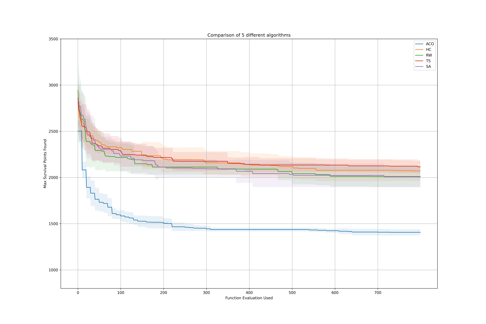

Answer of every sub-problem are listed below
__(a), (b)__
Please refer to `Distance Table` in `./util.py`

__(c)、(d)、(e)、(f)、(g)__  
See the .py file in this folder for implemeting details.

The constraint of this problem is that the salesman can not travel to the city that he already visited.
Unlike in problem 1, where I try to add penalty when the constraint is break. 
In this problem, I just simply define a mutation rules that will not transfer a suitable solution to a unsuitable solution.

Specificially, the code support three types of mutation operation:
`two_opt_mutation`
`reinsertion_mutation`
`flip_path_mutation`
Here is a simple demo of this three operators:
original : [0, 1, 2, 3, 4, 5, 6, 7, 8, 9, 0]
==== 2-opt operation ====
(switch neighbor nodes sequentially at random 3 location)
[0, 2, 1, 3, 4, 6, 7, 5, 8, 9, 0] 
[0, 2, 1, 4, 3, 5, 6, 8, 7, 9, 0]
...
====   Reinsertion   ====
(pick a random node out and insert it at another random location, do twice sequentially)
[0, 1, 6, 3, 2, 4, 5, 7, 8, 9, 0] 
[0, 1, 9, 2, 3, 7, 4, 5, 6, 8, 0]
...
====    Flip Path    ====
(pick random two nodes as start and end, reverse the path in beween. The chosen path should be >= 3)
[0, 1, 8, 7, 6, 5, 4, 3, 2, 9, 0] 
[0, 1, 2, 8, 7, 6, 5, 4, 3, 9, 0]

----

In Random Walk, Hill Clibing and Simulated Aneealing, the next solution is found by:
- performing [2-opt operation] with 33.3% probability
- performing [Reinsertion] with 33.3% probability
- performing [Flip Path] with 33.3% probability
----
In Tabu Search, we set the Tabu Object to be the three mutation operators.
Besides, the Tabu Tenure is set to 2, so there is always at least one feasible mutation.
Asipration criteria is : `Clean the Tabu List Every 7 iterations`
--> The results of this setting is based on a intuition where one can find more detail explaination in `./Problem3_TS.py`

----
In Ant Colony Optimization, the pheromone between two cities is updated via:
- 70% Evaporation
- Pheromone left by visted ants

Different ants will leave different amount of pheromone on the edge. Essentially, we calculate the Pheromone left by visited ant by two factors.

	# since maximum distance beween two city is 498
	local_factor = (500 - Distance_table[start, end])**2 
	# since never saw total path length can exceed 4500
	global_factor = (5 - total_path / 1000)**2 

The gloabl factor means that if an ant find a short path, the traveled edge is encouraged to be travel again.
The local factor means that the if edge itself is long, then the edge is discourage to be visited.

Finally, the increase Pheromon on the edge was computed by combining the two:

	 delta_pheromon =  0.85 * global_factor + 0.15 * local_factor 

__(h)__

From the progress diagram above, I summary some findings as below:

- ACO is the best among all algorithms
	
	Reach better solution roubustly. The mean and std are all the best compare to other four.

- Hill Climbing v.s. Simulated Annealing
	
	Simulated Annealing is the improvement version of Hill Climbing. We can indded see that SA slightly outperform Hill Climbing

- Random Walk v.s. Tabu Search
	
	Tabu Search can be viewd as an improvement version of Random Walk. 
	However, we do not see TS outperform RW. I think this is because the lack of tuning when setting Tabu Object and Aspiration Criteria. 
	Despite the ecpected result do not apper, I still think that the setting of my Tabu Algorithm is quite intuitive, so I might do more about TS as a future work.

- Random Walk v.s. Hill Climbing v.s. Simulated Annealing

	Random Walk slightly outperform Hill Climbing since preventing stuck in local optima；
	However, the imporved version of HC, i.e. SA, can now reach the similar performace as RW ! (Maybe by tuning the temeperature scheduling, it can outperform RW)
